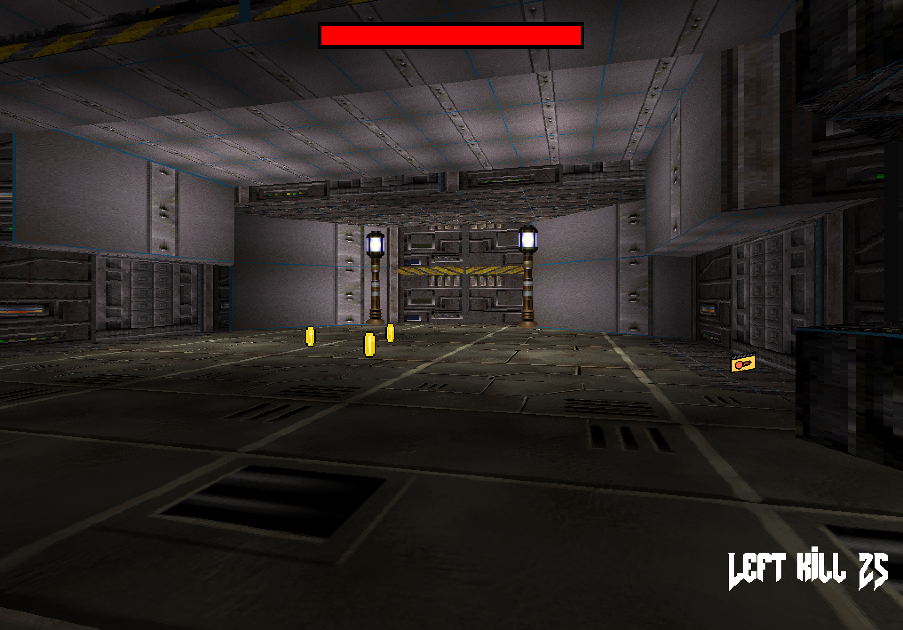
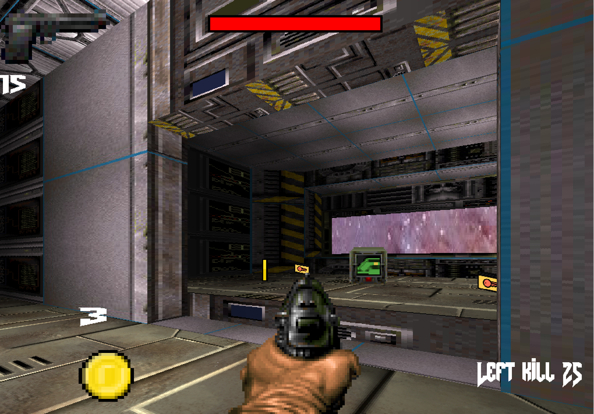
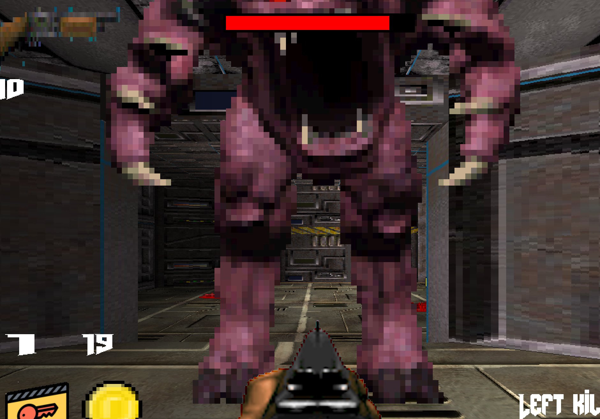
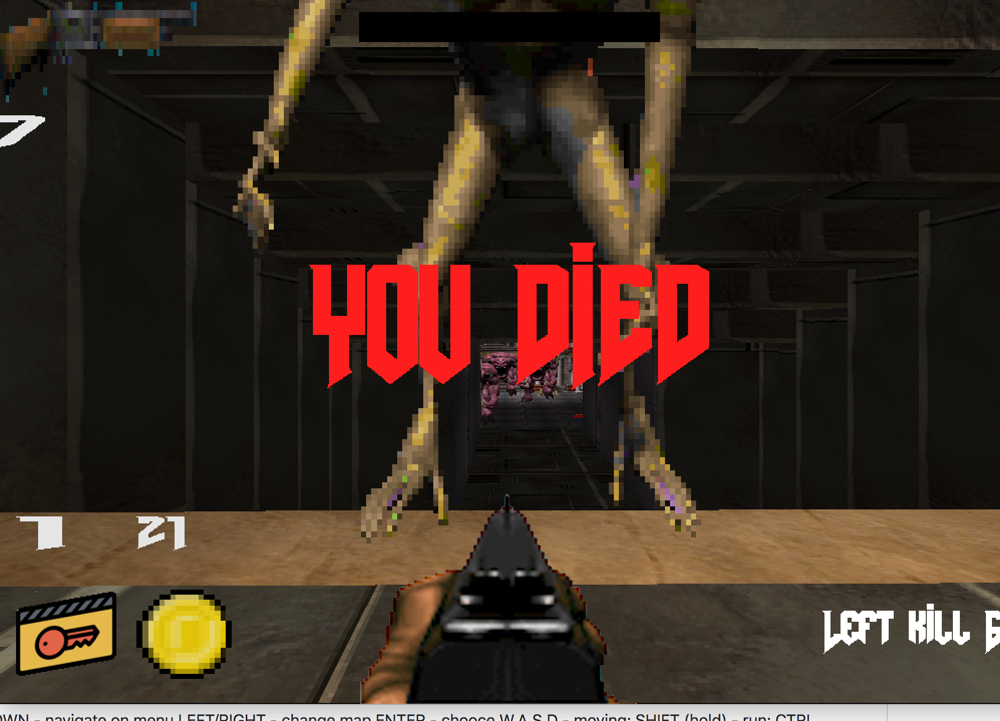

# My-Portal-Engine

Hello to everybody! This project is from 42 schools (Unit).
The project is the reproduction of the famous first person shooter Doom and Duke Nukem.

How it use?

UP/DOWN - navigate on menu
LEFT/RIGHT - change map
ENTER - chooce
W,A,S,D - moving;
SHIFT (hold) - run;
CTRL (hold) - sit;
E - open the door;
F - run the lift;
1,2,3 - to change weapon;
ESCAPE - exit
BACKSPACE - to menu/back to game
Mouse move - rotate;
Mouse button(left) - shoot;

On the game work two person. On the Level editor one.
Some math part we used was written "Bisqwit" (https://www.youtube.com/watch?v=HQYsFshbkYw).
Room

Oped door

Enemy

Dieing

